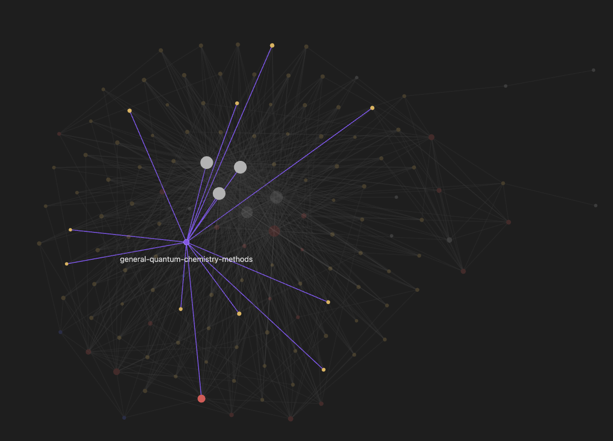

# oh-my-llm-wiki

A local-first agent skill for turning paper reading and research conversations
into an evidence-bounded Markdown wiki.

The repository contains the reusable skill only. It does not publish the local
wiki corpus or original papers.



## What it maintains

- Immutable local source provenance with SHA-256 and direct PDF links.
- One source page per paper, named by the paper title.
- Full-paper Methods/Results/Limitations review before promotion to `reviewed`.
- General method-family topics, method-improvement tables, and cross-paper
  relations.
- Human-focus queries that preserve what the user actually asked.
- Agent Queries with 3-5 paper-specific questions, an initial scored answer
  round, two scored rewrite rounds, and complete answer/feedback history.
- User-aware topic lifecycles without mixing one person's interests into
  another person's topic graph.
- Explicit `VERIFIED`, `EXTRACTED`, `INFERRED`, `AMBIGUOUS`, and `STALE`
  evidence boundaries.

## Install

```bash
git clone https://github.com/STOKES-DOT/oh-my-llm-wiki.git
mkdir -p ~/.agents/skills
ln -s "$PWD/oh-my-llm-wiki" ~/.agents/skills/llm-wiki-maintainer
```

The repository root is the skill directory and contains `SKILL.md`.

### One-paste agent install

Paste one prompt into your agent.

**Codex**

```text
Install or update https://github.com/STOKES-DOT/oh-my-llm-wiki as my personal Codex skill at ~/.agents/skills/llm-wiki-maintainer. Clone it if missing; if it is already the same Git repo, use git pull --ff-only. If the target has local changes or unrelated files, stop and ask me. Run python3 tests/test_read_pdf.py and report the install path and test result.
```

**Claude Code**

```text
Install or update https://github.com/STOKES-DOT/oh-my-llm-wiki as my personal Claude Code skill at ~/.claude/skills/llm-wiki-maintainer. Clone it if missing; if it is already the same Git repo, use git pull --ff-only. If the target has local changes or unrelated files, stop and ask me. Run python3 tests/test_read_pdf.py and report the install path and test result.
```

## Use

Invoke the skill explicitly or discuss a paper in a workspace that uses a
`.wiki/` knowledge base:

```text
$llm-wiki-maintainer

Here is a paper. What does "real space" mean, and how does it differ from
Hamiltonian learning? Update the wiki with the answer.
```

The skill routes durable knowledge into:

```text
.wiki/
├── raw/       immutable local sources; never published by this repository
├── wiki/
│   ├── sources/
│   ├── concepts/
│   ├── topics/
│   ├── queries/
│   ├── relations.md
│   └── method-improvements.md
└── output/    derived local artifacts
```

## Agent Queries

Every new-paper ingest runs a paper-understanding and maintained-wiki
extrapolation audit. The Main Agent is the sole writer; Organizer, Questioner,
and Evaluator are read-only roles. The Questioner creates 3-5 frozen questions,
and the Organizer answers each question in separate paper-grounded and
knowledge-base-augmented lanes. Non-blocked runs execute exactly three
complete answer-score rounds; blocked runs preserve all attempt and failure
records, plus only the question, answer, feedback, and score artifacts that
actually completed. Every available evaluator score and feedback record is
retained.

A query becomes `reviewed` only when every question passes the final 100-point
gates. A completed three-round run with a failed gate is `review_pending`; an
unmet prerequisite or exhausted retry is `pipeline_blocked` while source
ingest continues.

```text
PDF reader + existing wiki
        |
        v
Evidence Pack
        |
        +--> Organizer: source draft
        |
        +--> Questioner: 3-5 questions
                         |
                         v
Round 1: Organizer answers
         -> Evaluator scores/feedback
Round 2: Organizer revises
         -> Evaluator scores/feedback
Round 3: Organizer revises
         -> Evaluator final score
                         |
                         v
Main Agent validates and writes:
source page + agent-queries page + relations/topic/index/log
```

The durable page is written to
`.wiki/wiki/queries/<paper-title>-agent-queries.md`; complete machine history
is retained under
`.wiki/output/agent-query-runs/<paper-sha256>/<run-date>/`. Here `<run-date>`
is the unique run identifier defined by the pipeline contract, not a
display-only date. See
[`references/agent-queries-pipeline.md`](references/agent-queries-pipeline.md)
for the executable role, scoring, retry, and storage contract, and
[`templates/agent-queries.md`](templates/agent-queries.md) for the durable page
format.

## Generic PDF reader

The bundled reader uses Poppler to produce deterministic evidence artifacts:

```bash
python3 scripts/read_pdf.py paper.pdf \
  --output-dir /private/tmp/paper-read \
  --render 1,4-5
```

Outputs:

- `metadata.json` with SHA-256, page count, PDF metadata, and selected pages.
- `layout_text_page_marked.txt` with explicit PDF page boundaries.
- `section_index.json` and `section_index.md` for conservative navigation.
- Optional rendered PNG pages for figures, tables, equations, and multi-column
  layout checks.

The section index is a navigation hint, not scientific evidence. A paper is
only promoted after the relevant source sections and visual pages are reviewed.

## Shared evidence, personalized attention

Shared topics describe source-supported method families. User-specific topics
live under a separate namespace and require confirmation, recurrent interest,
or explicit delegation. A single paper question becomes a human-focus record or
query, not an automatic topic subscription.

```text
wiki/topics/<slug>.md                    shared method topic
wiki/topics/users/<user-key>/index.md   one user's topic index
wiki/topics/users/<user-key>/<slug>.md  one user's interest topic
```

## Repository layout

```text
SKILL.md
references/agent-queries-pipeline.md
templates/agent-queries.md
scripts/read_pdf.py
tests/test_agent_queries_contract.py
tests/test_read_pdf.py
examples/knowledge-graph.png
```

Run the tests with:

```bash
python3 tests/test_read_pdf.py
python3 tests/test_agent_queries_contract.py
```

## Privacy and copyright boundary

The skill is designed for local research libraries. Original PDFs, personal
queries, project instructions, and local Obsidian workspace state stay outside
this repository. Publish only material you have the right to share.
